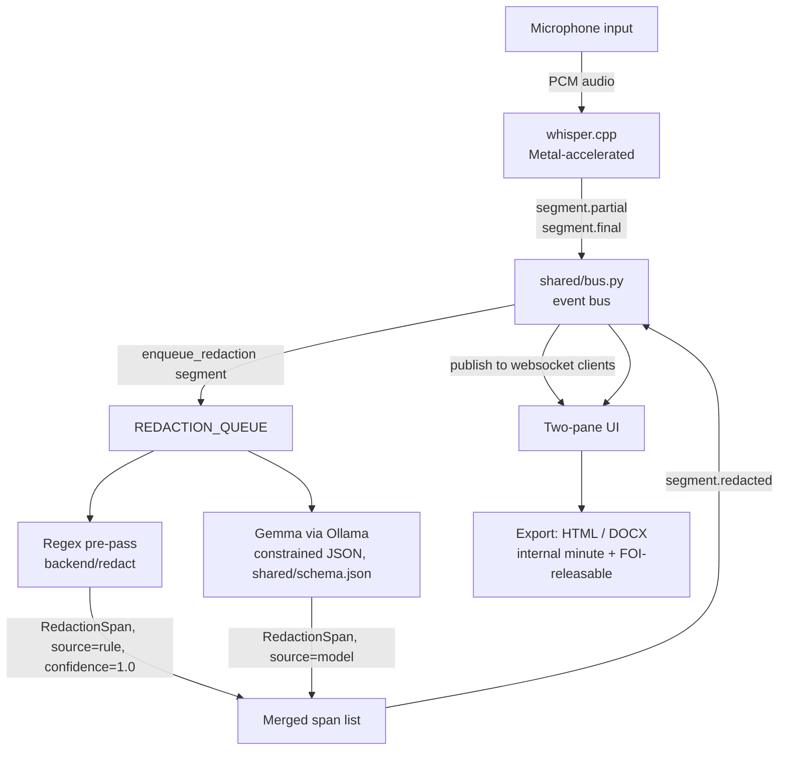

# ARCHITECTURE

## Data flow

Each transcribed segment travels one way through the pipeline: whisper
finalises it, the event bus fans it out to every connected websocket client
for the internal-minute pane immediately, and in parallel drops it onto
`REDACTION_QUEUE` for redaction. The regex layer and Gemma both read the same
segment text and both append `RedactionSpan` entries; the backend merges
them and publishes `segment.redacted`, which is what paints the FOI pane.

## Latency budget

| Stage | Budget |
|---|---|
| whisper.cpp finalise | ≤ 800 ms |
| Regex pre-pass | ≤ 5 ms |
| Gemma redaction pass | ≤ 1200 ms |
| **Total, speech to black bar on screen** | **≤ 2 s** |

The regex layer is fast enough to be invisible; the budget is really whisper
plus Gemma, run so the audience never sees an unredacted sentence sit on
screen for more than about two seconds.

## Graceful degradation ladder

REDLINE is built to keep working, in a visibly degraded form, when a
dependency is missing — never to crash the demo:

1. **Full pipeline**: whisper.cpp (Metal) + Ollama + Gemma. Both panes live,
   full latency budget above.
2. **Gemma unavailable, regex still runs**: the FOI pane still redacts
   everything the regex layer can catch (NHS numbers, National Insurance
   numbers, and other fixed-format identifiers) and shows those spans as
   `source: "rule"`. Free-text exemptions that need language understanding
   are missed, and the UI should say so, not silently under-redact.
3. **Ollama down entirely**: same as above — regex is the safety net, not a
   nice-to-have, precisely because it does not depend on Ollama being up.
4. **whisper.cpp or microphone unavailable**: fall back to `make demo`, which
   replays `demo/seed_transcript.json` through the same redaction pipeline
   and UI, so the audience still sees real, live redaction behaviour.
5. **Nothing available**: `doctor.py` fails loudly, per check, before the
   demo starts, rather than the demo failing silently mid-meeting.

## Model allocation

| Task | Model | Where it runs |
|---|---|---|
| Speech to text | whisper.cpp, `ggml-small.en.bin` (falls back to `ggml-base.en.bin`) | On-device, Metal-accelerated |
| Fixed-format identifier redaction (NHS numbers, National Insurance numbers, etc.) | Deterministic regex | On-device, no model |
| Free-text exemption redaction | Gemma (`gemma3n:e2b`) via Ollama, constrained decoding against `shared/schema.json` | On-device, `http://localhost:11434` only |
| Minutes summarisation (decisions/actions/attendees) | Gemma via Ollama | On-device, `http://localhost:11434` only |

## Why local inference is required, not preferred

A public body cannot send unredacted OFFICIAL-SENSITIVE material to a
third-party API in order to find out what needs redacting. The act of asking
a cloud model to identify the sensitive spans in a sentence is itself the
disclosure of that sentence to a third party. There is no version of "ask a
cloud API which parts of this meeting are exempt from release" that does not
first require releasing the whole meeting to that API.

The UK Government's own guidance is explicit on this point. The HMG
Generative AI Framework restricts putting sensitive or personal data into
public cloud AI tools. A safeguarding referral, a live procurement figure, or
legal advice under privilege is exactly the class of material the framework
is written to keep off third-party infrastructure. So the redaction
detection step, not just the storage of the final minute, must run on-device.
This is why REDLINE calls Ollama only at `http://localhost:11434` and makes
zero calls to any other network address: the constraint is not a performance
choice, it is the only way the product's core claim (this meeting never left
the room) stays true.

## Why the model returns substrings, not offsets

`shared/schema.json` asks Gemma for the exact original substring of each
redaction, plus its exemption, not a character start/end offset. Large
language models are reliably bad at character-level arithmetic: asking a
model to count offsets into a transcript it is reading, rather than asking it
to quote text it has already read, trades a task models are weak at for a
task models are strong at.

The backend then has to find that quoted substring back inside
`Segment.text` to build a `RedactionSpan`. It does this with a three-tier
fallback:

1. **Exact match** — the substring appears verbatim in the segment text.
2. **Normalised match** — whitespace and punctuation differences (a smart
   quote where the model wrote a straight one, doubled spaces) are
   normalised on both sides before matching.
3. **Fuzzy match** — a small edit-distance search locates the closest
   substring when the model paraphrased slightly instead of quoting exactly.

If all three fail, the span is dropped rather than guessed at a wrong offset
— a missed model redaction is a gap the regex layer or a human reviewer can
still catch; a wrongly-placed span would redact the wrong words and silently
under-protect the real ones.

## Why regex is the primary safety net, not a nice-to-have

Gemma is a generative model: it can miss a redaction, hallucinate one that
isn't there, or return a substring that doesn't survive the fallback matching
above. None of those failure modes are acceptable for information covered by
an absolute exemption like s.40(2) personal data. The regex layer has no such
failure mode for the fixed-format identifiers it targets — an NHS number
either matches the pattern or it doesn't, deterministically, every time,
whether or not Ollama is even running.

That is why the regex layer is not a supplementary pass that improves recall
on top of Gemma. It is the layer that is still redacting correctly in
degradation rungs 2 and 3 above, when Gemma is unavailable entirely. Gemma
adds coverage for the exemptions regex cannot express — a name in a
safeguarding context, a policy still being drafted — but the guarantee that
REDLINE never releases a bare NHS number comes from the regex layer, not from
the model.

## Why this matters now

94,526 FOI requests reached UK central government in 2025, up 14% on the
prior year, and ICO complaints about FOI handling are up roughly 40% year on
year (figures supplied by the team). Redaction time is explicitly excluded
from the FOIA s.12 appropriate-cost limit that lets a public body refuse an
expensive request — so the most expensive part of compliance is the one part
the law does not let anyone count against the clock. Moving redaction
detection to the moment of speech, on-device, is a response to that specific
gap.
