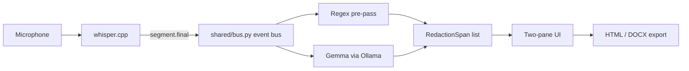

# REDLINE

Offline meeting recorder for UK public bodies. One meeting produces two
records: the full internal minute, and an FOI-releasable version with FOIA
2000 exemptions applied live, on-device.

```
 ┌─────────────────────────────┬─────────────────────────────┐
 │  INTERNAL MINUTE             │  FOI-RELEASABLE              │
 ├─────────────────────────────┼─────────────────────────────┤
 │ Dr Sarah Whitfield's        │ ▓▓▓▓▓▓▓▓▓▓▓▓▓▓▓▓▓▓▓▓         │
 │ referral, NHS number four   │ ▓▓▓▓▓▓▓▓▓▓▓▓▓▓▓▓▓▓▓▓         │
 │ zero zero, one two three,   │ ▓▓▓▓▓▓▓▓▓▓▓▓▓▓▓▓▓▓▓▓         │
 │ four five six four, sits    │ sits alongside the           │
 │ alongside the Ardent        │ ▓▓▓▓▓▓▓▓▓▓▓▓▓▓ award at       │
 │ Systems award at £2.4       │ ▓▓▓▓▓▓▓▓▓▓, and both items    │
 │ million, and both items     │ need the redaction applied   │
 │ need the redaction applied  │ before release.               │
 │ before release.              │  [s.40(2)] [s.38] [s.43(2)]  │
 └─────────────────────────────┴─────────────────────────────┘
```

Every word is transcribed and shown on the left as it is spoken. A regex
pre-pass and a local Gemma model, running side by side, find the parts that
FOIA 2000 lets a public body withhold, and black them out on the right, live,
with the statutory exemption tagged next to each redaction. Nothing leaves
the machine.

## The problem

UK central government received 94,526 FOI requests in 2025, up 14% on the
year before, and ICO complaints about FOI handling are up roughly 40% year on
year (figures supplied by the team). Redaction is the slowest part of
answering a request, and it is explicitly excluded from the statutory s.12
cost limit — so the most expensive step in FOI compliance is the one step
nobody is allowed to count against the clock. REDLINE moves that step to the
moment the meeting happens, instead of weeks later when someone has to
re-listen to a recording under deadline pressure.

## What the two panes show

- **Internal minute (left)** — the full transcript, unredacted, exactly as
  said. This is the record the public body keeps.
- **FOI-releasable (right)** — the same transcript with exempt material
  blacked out live, each redaction tagged with its FOIA 2000 section (e.g.
  `s.40(2)` personal data, `s.43(2)` commercial interests, `s.38` health and
  safety). This is the record a requester would receive.

Redaction detection runs in two layers that both write to the same spans
list: a deterministic regex layer (NHS numbers, National Insurance numbers,
and similar fixed-format identifiers) and a local Gemma model reading the
same text for exemptions regex cannot express (a name attached to a
safeguarding case, a policy still being drafted). See `ARCHITECTURE.md` for
why both layers exist and why neither call ever leaves the device.

## Architecture



Full data-flow diagram, latency budget, degradation ladder, and the
"local inference is required, not preferred" argument are in
`ARCHITECTURE.md`.

## Repo layout

- `shared/contracts.py` — frozen wire contracts: `Exemption`, `RedactionSpan`,
  `Segment`, the FOIA label/colour/statute tables, and the WebSocket envelope
  spec.
- `shared/schema.json` — the JSON Schema handed to Ollama for constrained
  decoding of redactions.
- `shared/bus.py` — the event bus (`publish`, `subscribe`, `REDACTION_QUEUE`,
  `enqueue_redaction`) that connects the backend and the redaction pipeline
  without a circular import.
- `backend/` — FastAPI backend (`backend/main.py`, once written, serves the
  WebSocket and drives whisper.cpp) and `backend/redact/` (the regex + Gemma
  redaction pipeline).
- `frontend/` — the two-pane UI.
- `demo/` — a guaranteed-working replay demo: `demo/seed_transcript.json` and
  `demo/script.md` (the recorded script and the reference redaction table).
- `doctor.py` — environment health check (Ollama, models, whisper binary,
  ports, audio device).
- `Makefile` — the entry points below.

## Setup

These steps are the intended path. `setup.sh` and `backend/main.py` /
`frontend/` are being built alongside this document; if a step below isn't
wired up yet in your checkout, that is a work-in-progress gap, not a wrong
instruction.

1. Clone the repo, including submodules (whisper.cpp lives under
   `third_party/`):
   ```
   git clone --recurse-submodules <repo-url>
   cd redline
   ```
2. Install [Ollama](https://ollama.com) and start it (`ollama serve`, or the
   desktop app). REDLINE talks to it only on `http://localhost:11434` — no
   other network address is ever contacted.
3. Pull the models REDLINE uses:
   ```
   ollama pull gemma3n:e2b
   ```
   (whisper.cpp's own speech models, `ggml-base.en.bin` and
   `ggml-small.en.bin`, are downloaded by `make setup` into
   `third_party/whisper.cpp/models/`.)
4. Run the one-shot environment setup:
   ```
   make setup
   ```
   This builds whisper.cpp, creates the Python virtualenv from
   `requirements.txt`, downloads the whisper models, and installs frontend
   dependencies.
5. Check everything is ready:
   ```
   make doctor
   ```
   This confirms Ollama is running with the redaction model loaded, the
   model responds inside the latency budget, constrained JSON decoding
   matches `shared/schema.json`, the whisper binary and models are present,
   an audio input device exists, and ports 8000/5173 are free.

## Running it

```
make run
```

Starts the FastAPI backend on `:8000` and the frontend on `:5173`, and
records live from the microphone.

## Running the guaranteed-working demo

If a live microphone, whisper, or Ollama is not reliably available (a noisy
room, no model pulled yet), use the replay demo instead:

```
make demo
```

This replays `demo/seed_transcript.json` — the same script recorded and
transcribed in `demo/script.md` — through the identical redaction pipeline
and UI, so the two-pane behaviour is exactly what a live run produces,
without depending on a microphone at demo time.

## Licence

MIT. See `LICENSE`.
